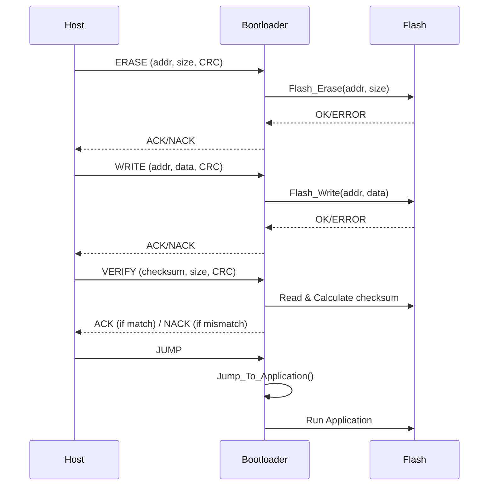

# STM32 Bootloader (FOTA)

Bootloader STM32F1 hỗ trợ cập nhật firmware qua UART từ PC Host.

---

## 📑 Mục lục

- [Giới thiệu](#giới-thiệu)
- [Giao tiếp Host ↔ Node](#giao-tiếp-host--node)
- [Command chính](#các-loại-command-chính)
- [Quy trình nạp firmware](#quy-trình-nạp-firmware)
- [Cấu trúc dự án](#cấu-trúc-dự-án)
- [Hướng dẫn sử dụng](#hướng-dẫn-sử-dụng)
- [Tài liệu tham khảo](#tài-liệu-tham-khảo)
- [Giấy phép](#giấy-phép)

---

## Giới thiệu

Bootloader là chương trình nhỏ chạy đầu tiên khi STM32 khởi động, cho phép nạp/chạy ứng dụng.  
Ở đây, PC sẽ gửi command qua UART, STM32 bootloader xử lý và cập nhật firmware.

---

## Giao tiếp Host ↔ Node

### Cấu trúc command

```text
[Length][Command][Data][CRC]

```

- **Length**: số byte command  
- **Command**: loại lệnh (Read/Erase/Write/Jump)  
- **Data**: payload (nếu có)  
- **CRC**: kiểm tra dữ liệu  

### Response

```text
[ACK/NACK][Data][ValidFlag]

```

- ACK (0x79) / NACK (0x1F)  
- Data trả về (nếu có)  
- Valid/Invalid flag  

### Sequence Diagram



---

## Các loại command chính

- **Read**: đọc dữ liệu flash  
- **Erase**: xóa vùng flash  
- **Write**: ghi dữ liệu flash  
- **Jump**: nhảy vào Application  

---

## Quy trình nạp firmware

1. Host mở file `application.bin`  
2. Host gửi `ERASE` để xóa vùng app  
3. Host gửi nhiều block `WRITE` để ghi firmware  
4. Host gửi `VERIFY` để so checksum  
5. Nếu pass → gửi `JUMP` → MCU chạy app  

---

## Cấu trúc dự án

```text
stm32Fota/
├── app/             # Firmware & tool chuyển hex → bin
├── hostPC/          # Script Python nạp firmware
└── nodeMCU/         # Source bootloader STM32
```

---

## Hướng dẫn sử dụng

### Build và triển khai

1. Build bootloader trong `nodeMCU/` và nạp vào STM32  
2. Chuyển đổi firmware ứng dụng `.hex` sang `.bin` bằng tool trong `app/Hex_To_Bin/`  
3. Chạy `python hostBootloader.py` trong `hostPC/` để gửi lệnh nạp firmware  

---

## Tài liệu tham khảo

- STM32F1 Reference Manual  
- AN3155: USB DFU protocol  
- AN2606: STM32 system memory boot mode  

---

## Giấy phép

Dự án này phát hành theo giấy phép **MIT** – xem file `LICENSE`
